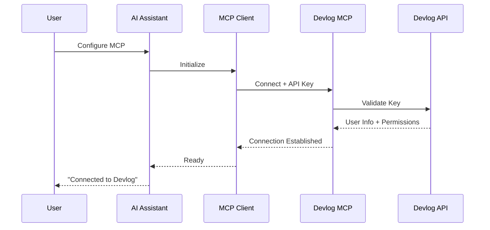

# MCP Deployment and User Access Guide

## Where It's Deployed

### Primary Deployment: Multi-Region Cloud Infrastructure

#### 1. **Global Edge Network (Like Stripe)**
```
┌─────────────────────────────────────────┐
│        Cloudflare Global Edge           │
│   (100+ Points of Presence Worldwide)   │
└─────────────────┬───────────────────────┘
                  │
┌─────────────────▼───────────────────────┐
│          AWS/GCP Multi-Region           │
│                                         │
│  ┌─────────┐  ┌─────────┐  ┌─────────┐│
│  │US-EAST-1│  │EU-WEST-1│  │AP-SOUTH││
│  └─────────┘  └─────────┘  └─────────┘│
└─────────────────────────────────────────┘
```

#### 2. **Infrastructure Stack**

**Frontend Gateway**:
- **Cloudflare Workers** for edge computing
- **URL**: `https://mcp.devlog.design`
- **Alternate**: `https://api.devlog.design/mcp`

**Backend Services**:
```yaml
Production Regions:
  Primary:
    - us-east-1 (Virginia) - Americas
    - eu-west-1 (Ireland) - Europe
    - ap-southeast-1 (Singapore) - Asia
  
  Failover:
    - us-west-2 (Oregon)
    - eu-central-1 (Frankfurt)
    - ap-northeast-1 (Tokyo)
```

**Database**:
- Supabase (Already deployed)
- Read replicas in each region
- Connection through private networking

## How Users Access It

### 1. **For AI Assistant Users (Primary)**

#### Claude Desktop/Claude.ai
```json
// Users add to their Claude configuration
{
  "mcpServers": {
    "devlog": {
      "command": "npx",
      "args": ["-y", "@devlog/mcp"],
      "env": {
        "DEVLOG_API_KEY": "dvlg_sk_live_..."
      }
    }
  }
}
```

#### VS Code / Cursor
```bash
# One-line installation
code --add-mcp devlog --api-key YOUR_KEY

# Or via settings.json
{
  "mcp.servers": {
    "devlog": {
      "uri": "https://mcp.devlog.design",
      "apiKey": "${env:DEVLOG_API_KEY}"
    }
  }
}
```

### 2. **API Key Generation Flow**

```
User Journey:
1. Login to devlog.design
2. Navigate to Settings → API Keys
3. Click "Create MCP Key"
4. Select permissions:
   - Read (default)
   - Write
   - Admin (optional)
5. Copy key (shown once)
6. Add to AI assistant config
```

### 3. **Connection Methods**

#### Method A: NPX Package (Recommended)
```bash
# Installs thin client that connects to remote
npx @devlog/mcp --api-key=dvlg_sk_live_xxxxx

# What happens:
# 1. NPX downloads lightweight client (~50KB)
# 2. Client connects to https://mcp.devlog.design
# 3. Authenticates with API key
# 4. Establishes SSE connection
# 5. Ready for AI assistant to use
```

#### Method B: Direct URL (Advanced)
```typescript
// For custom integrations
const mcp = new MCPClient({
  url: 'https://mcp.devlog.design',
  apiKey: process.env.DEVLOG_API_KEY,
  transport: 'http+sse'
});
```

#### Method C: SDK (Coming Soon)
```javascript
// JavaScript/TypeScript
import { DevlogMCP } from '@devlog/mcp-sdk';

const client = new DevlogMCP({
  apiKey: 'your-key'
});

// Python
from devlog_mcp import Client
client = Client(api_key="your-key")
```

### 4. **Authentication Flow**



### 5. **Regional Access Optimization**

```typescript
// Automatic region selection
const endpoint = await selectOptimalEndpoint({
  userLocation: geoIP.location,
  endpoints: [
    'https://us.mcp.devlog.design',
    'https://eu.mcp.devlog.design',
    'https://ap.mcp.devlog.design'
  ],
  maxLatency: 50 // ms
});
```

## Deployment Architecture Details

### Container Orchestration
```yaml
# Kubernetes deployment across regions
apiVersion: networking.k8s.io/v1
kind: Ingress
metadata:
  name: mcp-ingress
  annotations:
    kubernetes.io/ingress.class: "nginx"
    cert-manager.io/cluster-issuer: "letsencrypt"
spec:
  tls:
  - hosts:
    - mcp.devlog.design
    secretName: mcp-tls
  rules:
  - host: mcp.devlog.design
    http:
      paths:
      - path: /
        pathType: Prefix
        backend:
          service:
            name: mcp-gateway
            port:
              number: 80
```

### CDN Configuration
```nginx
# Cloudflare Workers script
addEventListener('fetch', event => {
  event.respondWith(handleRequest(event.request))
})

async function handleRequest(request) {
  // Geolocation routing
  const country = request.cf.country
  const region = getRegion(country)
  
  // Route to nearest MCP instance
  const origin = `https://${region}.internal.mcp.devlog.design`
  
  return fetch(new Request(origin + request.url.pathname, {
    method: request.method,
    headers: request.headers,
    body: request.body
  }))
}
```

### Security Layers
```
Internet
    ↓
Cloudflare (DDoS, WAF, Rate Limiting)
    ↓
AWS ALB (Load Balancing, SSL Termination)
    ↓
Kubernetes Ingress (Path Routing)
    ↓
MCP Gateway Pods (Authentication)
    ↓
Worker Pods (Business Logic)
    ↓
Supabase (Private Network)
```

## Cost Optimization

### Pricing Tiers
```typescript
const pricingTiers = {
  free: {
    requests: 10_000,     // per month
    rateLimit: 10,        // per minute
    features: ['read', 'basic_write']
  },
  pro: {
    requests: 1_000_000,  // per month
    rateLimit: 100,       // per minute
    features: ['all'],
    price: 29            // USD per month
  },
  enterprise: {
    requests: Infinity,
    rateLimit: 1000,      // per minute
    features: ['all', 'sla', 'support'],
    price: 'custom'
  }
}
```

### Infrastructure Costs (Estimated)
- **Cloudflare Workers**: $0.50 per million requests
- **Kubernetes Cluster**: ~$2000/month per region
- **Data Transfer**: ~$0.08/GB egress
- **Redis Cache**: ~$500/month
- **Monitoring**: ~$300/month

Total: ~$8,000/month for 10M requests/day

## User Onboarding Flow

### Step 1: Sign Up
```
devlog.design → Settings → API Keys → Create Key
```

### Step 2: Install
```bash
# Copy this command from dashboard
npx @devlog/mcp --setup
```

### Step 3: Configure AI Assistant
- **Claude**: Paste in config file
- **VS Code**: Use command palette
- **Cursor**: Add to settings

### Step 4: Verify Connection
```
AI: "Show me my Devlog documents"
Response: "I can see you have 42 documents..."
```

## Monitoring Dashboard

Users can monitor their usage at:
```
https://devlog.design/dashboard/api
```

Shows:
- Request count
- Rate limit status
- Error logs
- Usage by AI assistant
- Cost tracking (for paid tiers)

This deployment strategy ensures:
1. **Global availability** with <50ms latency
2. **Easy access** via one-line setup
3. **Scalability** to handle millions of users
4. **Security** with multiple protection layers
5. **Cost efficiency** with usage-based pricing